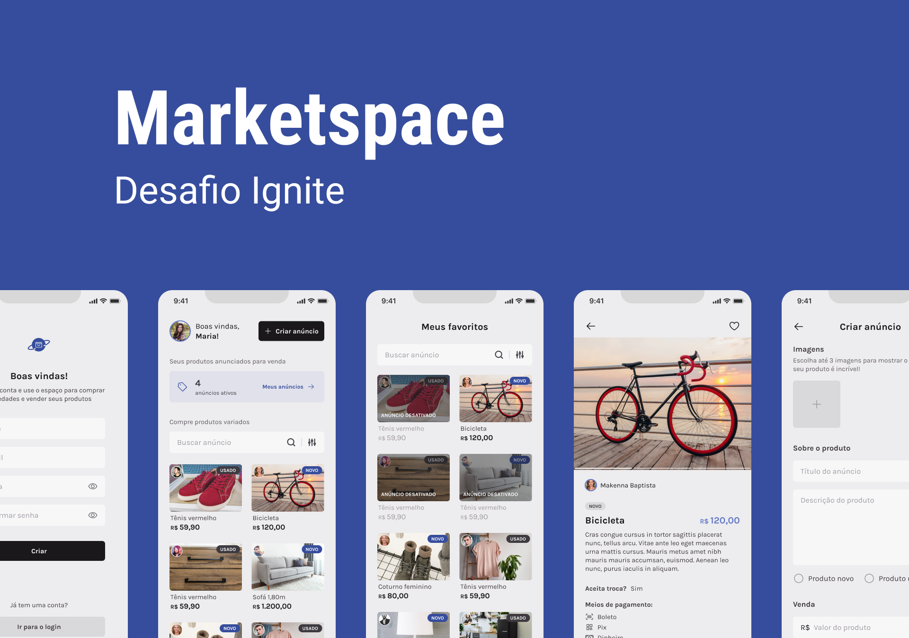

  <div width="100%" overflow="hidden" align="center">
  
  </div>
  <br>
  <br>
  <br>

## 📚 About

This project is based on an marketspace app which allows user to announce products, manage its own products (enable, disable and even remove them). This app also allows user to explore on sale products, check product details and call seller on whatsapp. 

This aim behind this project was to practice the conceps of **RESTful API**, **Context API**, **Form Validation**, **WhatsApp Linking**, **Multiple Image Upload**, **Navigation Nesting** and **Async Storage**.

## 🔨 Technologies

This project was developed with the following technologies:

- [Expo](https://expo.io/)
- [TypeScript](https://www.typescriptlang.org/)
- [React Native](https://reactnative.dev/)
- [React Navigation](https://reactnavigation.org/)
- [React Hook Form](https://react-hook-form.com/get-started#ReactNative)
- [Reanimated Carousel](https://github.com/dohooo/react-native-reanimated-carousel)
- [Gorhom Bottom Sheet](https://gorhom.github.io/react-native-bottom-sheet/modal/)
- [Axios](https://github.com/axios/axios)
- [Yup](https://www.npmjs.com/package/yup)
- [Native Base](https://nativebase.io/)
- [Async Storage](https://docs.expo.dev/versions/latest/sdk/async-storage/)


## 📱 Run project

```bash
  # Clone the project
  $ git clone https://github.com/pedroalvesz/marketspace.git
```

```bash
  # Install the dependencies, if you use npm
  $ npm install
```

<p align="center">or</p>

```bash
  # Install the dependencies, if you use yarn
  $ yarn
```


## 💬 Find me elsewhere


<a href="https://github.com/pedroalvesz"></a> <a href="mailto:opedrohenriqu@gmail.com"></a> <a href="https://www.linkedin.com/in/henriqpedro/" target="_blank"></a>
